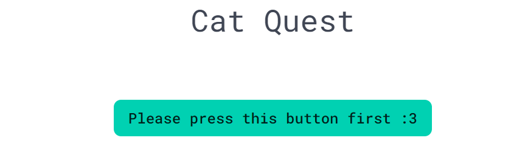
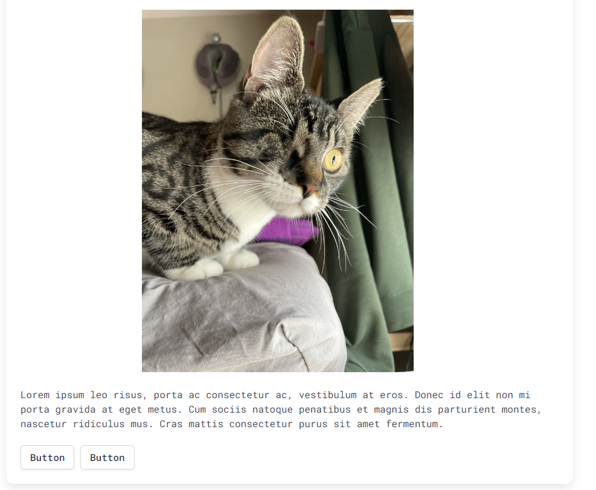

# CatQuest

## Description

CatQuest is an HTML mini game where the user will battle or try to escape from cat enemies. 
The story will change as the user keeps clicking buttons and taking damage from random cat images.  
This project helped us work as a team to create a webpage from zero using HTML, CSS and JavaScript language.  
We chose to make a mini game to solve boredom while applying HTML, CSS and JavaScript concepts learned in the last 6 weeks.  

## Usage

Go to https://steakbutter.github.io/Rubber-Butter/ and type in your username.    
    
     
Read the story and choose your action by clicking the buttons below the text. 
    
progress through the story until you reach the last mob or lose all of your hitpoints. 

## Credits

Sol Torres: https://github.com/Choledad
Karen Gutierrez: https://github.com/Kahlium
Carlos Gonzalez: https://github.com/steakbutter

## License

N/A.

